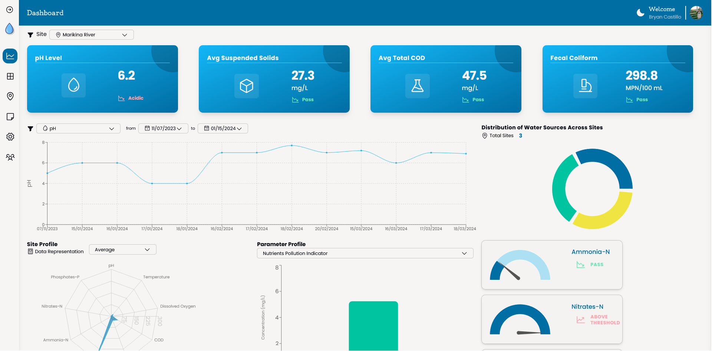
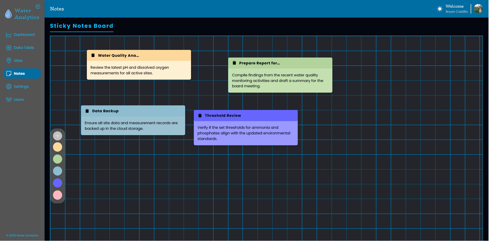

## 🌊 Water Analytics Web App

This **TypeScript-based** web application is designed for **modern water analytics monitoring**, ensuring **scalability** and **maintainability** through well-structured software development practices. The goal is to provide an efficient and reliable solution for monitoring water data with a robust and maintainable architecture.

## 1. 💻 Client Side (Frontend)

The client side of this application is built with **React and TypeScript**. Additional tools used include:

- **React-Redux** – Global state management  
- **Redux Toolkit Query** – API call handling  
- **Recharts** – Interactive chart visualization  
- **TanStack React Table** – Efficient table rendering  
- **Phosphor Icons** – Icon library  
- **Tailwind CSS** – Styling components and layouts  

The folder structure is organized based on **features**, with each feature containing similar subfolders such as **components**, **api**, **hooks**, and **utils**.

Meanwhile, **globally shared components and scripts** are placed in dedicated folders outside the feature-based structure. Through this structure, we can ensure modularity & maintainability of the app:

```bash
#client/src

├── 📦 app
│   ├── App.tsx
│   ├── CustomToastProvider.tsx
│   ├── PageNotFound.tsx
│   ├── ProtectedRoute.tsx
│   ├── Providers.tsx
│   └── 📂 routes
├── 📷 assets
│   └── 📂svg
├── 🧩 components
│   ├── 📂 common
│   ├── 📂 layout
│   ├── 📂 navigation
│   ├── 📂 pages
│   └── 📂 ui
├── 🌐 features
│   ├── 📂 app-settings
│   ├── 📂 auth
│   ├── 📂 dashboard
│   ├── 📂 sites
│   ├── 📂 stickynote
│   ├── 📂 thresholds
│   ├── 📂 user
│   └── 📂 waterquality
├── 🪝hooks
└── 📖lib
    ├── 📂 mappings
    └── 📂 redux

```


## 2. 🌐 Server Side (Backend)

The server side of this application is built with **Node-TS and Express**. Libraries and other tools were used to ensure efficient database management, authentication, security, and file handling:

- **Prisma ORM** – Handle database query & communication with the server
- **MongoDB** - Scalable No-SQL Database
- **Helmet** – Enhances security by managing HTTP headers  
- **Jsonwebtoken & Cookie-Parser** – for secure authentication and session management  
- **Multer** – Middleware for handling file uploads
- **Cloudinary SDK** – Cloud-based storage bucket for image uploads 
- **Nodemailer** – Manages email sending such as for password reset feature


```bash
#server
├── 🔑 auth
│   └── core
│       ├── 📂entity
│       ├── 📂interface
│       └── 📂service
├── 📈 dashboard
│   ├── core
│   │   ├── 📂 entity
│   │   ├── 📂 interface
│   │   └── 📂 service
│   └── utils
├── 🏢 infrastructure
│   ├── 📁 database
│   ├── 📁 errors
│   ├── 📁 express-server
│   ├── 📁 middleware
│   └── 📁 prisma
├── 📏 measurement
│   └── core...
├── 🗒️ notes
│   └── core...
├── 🌱seed
│   └── data
├── 📌site
│   └── core...
├── ⚠️ threshold
│   └── core...
├── 🙂user
│   └── core...
└── 🛠️ utils
```

### 3. Preview (Screenshots)





### 4. User Features

<mark class="highlight">User Role Management</mark> 

> This app supports different user roles. Administrators can view all accounts, adjust user privileges, and remove accounts as needed.

<mark class="highlight">Readily Available Data Template</mark> 

> When you sign up, sample data is automatically added so you can start exploring the app right away.

<mark class="highlight">Monitoring Site Data Management</mark> 

>Easily manage information for your water quality monitoring sites. Add, update, or remove site details to keep your data organized.

<mark class="highlight">Intuitive Water Quality Table</mark>

>View clear and simple tables that display water quality data for each site, making it easy to track changes over time.

<mark class="highlight">Customizable Parameter Thresholds</mark>

> Set your own acceptable levels for water quality measures. This lets the dashboard highlight when readings passes the regulation or it is above threshold.

<mark class="highlight">Dashboard Analytics</mark>

>The dashboard presents interactive charts and summaries that compare current water quality readings with your set limits.

<mark class="highlight">Sticky Notes App</mark>

>Keep track of your thoughts with built-in sticky notes that you can add, edit, and move around easily.

### 5. API Documentation

🔑 Authentication Routes ( _/api/auth_ )

<mark class="post badge">POST</mark> /api/auth/signup

Request Body:
```json
    {
    "username":"NewUser",
    "email": "newuser@email.com",
    "password": "somepassword456",
    "confirmPassword": "somepassword456",
    }
```

Response Body (Success):

```json
    {
    "message": "Congratulations, your account has been registered",
    "user": {
        "id": "123456789",
        "username": "NewUser",
        "password": "$hashedpassword",
        "email": "newuser@email.com",
        "profilePic": "defaultprofilepicfromcloudinary.png",
        "role": "PUBLIC"
    }
    }
```

Reponse Body (Error):
```json
    {
        "status":"fail",
        "message":"error reason"
    }
```

<mark class="post badge">POST</mark> /api/auth/signin

<mark class="post badge">POST</mark> /api/auth/signout


<mark class="get badge">GET</mark>

<mark class="put badge">PUT</mark>

<mark class="delete badge">DELETE</mark>

### 6. License

MIT License

Copyright (c) 2025 Bryan Castillo

Permission is hereby granted, free of charge, to any person obtaining a copy of this software and associated documentation files (the "Software"), to deal in the Software without restriction, including without limitation the rights to use, copy, modify, merge, publish, distribute, sublicense, and/or sell copies of the Software, and to permit persons to whom the Software is furnished to do so, subject to the following conditions:

The above copyright notice and this permission notice shall be included in all copies or substantial portions of the Software.


### 7. Developer

This project was built as part of my portfolio to showcase my full-stack web development skills using TypeScript, MERN, Prisma, and Tailwind CSS.


## ⚠️ Important Notice
This application relies on **environmental variables** for authentication, API access, and external services (e.g., database, storage). These variables are not included in this repository for security reasons. If you are interested in running or contributing to this project, please contact me for more details.

## 🔗 Developer Contacts: 

Github: [bryancastillo10][1]

LinkedIn: [Bryan Castillo ][2] 

[1]: https://github.com/bryancastillo10
[2]:[https://www.linkedin.com/in/bryan-castillo-479101171/]
 


<style>
  .highlight {
    background-color: #006da3;
    color: #f4f3f2;
    padding: 4px 6px;
    border-radius: 8px; 
  }

   .badge{
     font-weight:700;
     padding: 4px 8px;
     border-radius: 8px; 
    }

   .post {
    background-color: #F0E442;
    color: #111000;
    }

    .get{
    background-color: #21DCA9;
    color: #111000;
    }

    .put{
    background-color: #CE9108;
    color: #F4F3F2;
    }

    .delete{
    background-color: #CE0E2B;
    color: #F4F3F2;
    }
</style>